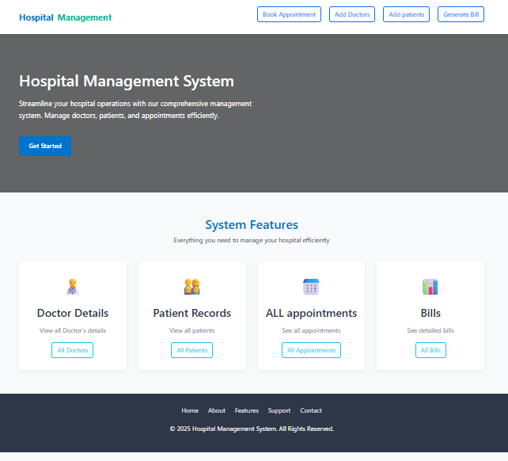

# Hospital Managment System

## Features

- **Patient Management:** Add, update, and view patient records.
- **Doctor Management:** Manage doctor profiles and schedules.
- **Appointment Scheduling:** Book, update, and cancel appointments.
- **Billing System:** Generate and manage patient bills.
- **Medical Records:** Store and retrieve patient medical histories.
<!-- - **User Authentication:** Secure login for staff and administrators. -->




## Installation

Before running this project, ensure you have the following dependencies installed:

- [Node.js](https://nodejs.org/) (version 14 or higher recommended)
- [npm](https://www.npmjs.com/) (comes with Node.js)
- [MySQL](https://www.mysql.com/) (for using the database)

To install project dependencies, use:

```bash
npm install express mysql2
```

## Running the Project

To start the application, use:

```bash
node app.js
```

Make sure you have created(Hospital_DB) database with all required tables before starting the application.